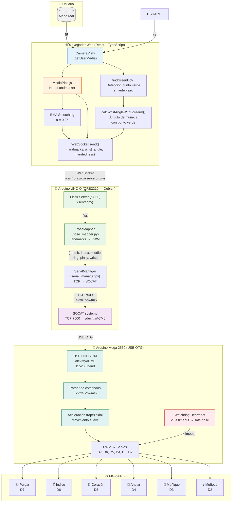

<div align="center">

# 🦾 Brazo Robótico V2

### Control por Visión Artificial · 6 GDL · Tiempo Real

[](https://brazo.nxserve.org)
[](https://brazo.nxserve.org)
[](LICENSE)

---

[](https://www.arduino.cc/)
[](https://www.arduino.cc/)
[](https://python.org)
[](https://flask.palletsprojects.com)
[](https://react.dev)
[](https://www.typescriptlang.org)
[](https://developers.google.com/mediapipe)
[](https://threejs.org)
[](https://www.cloudflare.com)

> **Proyecto Final de Curso** · Grado Superior en Electrónica  
> IES Virgen de la Encina · Mayo 2026  
> **Versión:** 2.3 (Beta) · **Stack:** Full-Stack Embedded

<br>

[🎯 Live Demo](https://brazo.nxserve.org) • 
[📖 Documentación](#-índice) • 
[🏗️ Arquitectura](#2-arquitectura-del-sistema) • 
[⚡ Inicio Rápido](#7-instalación)

---

</div>

<br>

Sistema de control de un **brazo robótico articulado de 6 grados de libertad** (5 falanges + muñeca) accionados por servomotores **MG996R**, mediante **visión por computador en tiempo real**. 

La cinemática del brazo replica los movimientos de la **mano humana** capturados a través de una cámara web convencional y procesados con **MediaPipe.js** en el navegador. El resultado: **controla un brazo robótico con tu propia mano** 🖐️ → 🤖

```
👋 → 🎥 (Cámara) → 🧠 (MediaPipe.js) → 🌐 (WebSocket seguro)
 → 🐍 (Flask API) → 🔗 (SOCAT bridge) → 🔌 (Mega 2560)
 → ⚙️ Servos MG996R ×6 → 🤖 ¡Movimiento en tiempo real!
```

---

## 📋 Índice

1. [Resumen Técnico](#1-resumen-técnico)
2. [Arquitectura del Sistema](#2-arquitectura-del-sistema)
3. [Hardware](#3-hardware)
4. [Software](#4-software)
5. [Algoritmos Clave](#5-algoritmos-clave-)
6. [Protocolo de Comunicación](#6-protocolo-de-comunicación)
7. [Instalación](#7-instalación)
8. [Referencia Rápida](#8-referencia-rápida)
9. [Historial](#9-historial)

---

## 1. Resumen Técnico

<br>

### 📊 Especificaciones del sistema

<div align="center">

| Parámetro | Valor | Parámetro | Valor |
|-----------|-------|-----------|-------|
| **Grados de libertad** | 6 (5 dedos + muñeca) | **Frecuencia tracking** | ~20–30 FPS |
| **Actuadores** | MG996R ×6 (2A stall c/u) | **Latencia extremo a extremo** | ~80–150 ms |
| **Cerebro** | Arduino UNO Q (Qualcomm) | **Cámara** | 640 × 480 px |
| **Control PWM** | Arduino Mega 2560 | **Baudrate serial** | 115200 bps |
| **Alimentación servos** | 5 V / 10 A+ (externa) | **Rango PWM seguro** | 800–2200 µs |
| **Protocolo** | WebSocket + Serial ASCII | **Rango operación** | 0°–180° |

</div>

### 🔌 Placas involucradas

| Placa | Función | Especificaciones |
|:-----:|---------|------------------|
| <br>**UNO Q** | Cerebro central: Flask + WebSocket, Linux | QRB2210 quad‑core @ 1.5 GHz, 512 MB RAM, Debian |
| <br>**Mega 2560** | Control PWM de 6 servos | ATmega2560, 16 MHz, 54 pines digitales |
| **Sensor Shield V2.0** | Shield de alimentación para servos | Bornas, regleta y conexión directa |
| **MG996R ×6** | Servomotores de alto torque | 9.4 kg·cm @ 4.8V, 0.17s/60° |

### Cadena de procesamiento

```
┌──────────┐   ┌──────────────┐   ┌──────────────┐   ┌──────────┐   ┌────────────┐   ┌──────────────┐   ┌──────────┐
│ Cámara   │ → │ MediaPipe.js │ → │ WebSocket    │ → │ Flask    │ → │ SOCAT      │ → │ Mega 2560    │ → │ Servos   │
│ USB/web  │   │ HandLandmark │   │ wss://:3000  │   │ (UNO Q)  │   │ TCP:7500   │   │ USB OTG      │   │ MG996R   │
│ 640×480  │   │ 21 landmarks │   │  → UNO Q     │   │ PoseMap  │   │ ↔ /dev/    │   │ PWM out      │   │ ×6       │
│ ~30 FPS  │   │ 3D + handed  │   │ ~20-30 msg/s │   │ → 6 PWMs │   │ ttyACM0    │   │ D7-D2 115200 │   │ 5 dedos  │
└──────────┘   └──────────────┘   └──────────────┘   └──────────┘   └────────────┘   └──────────────┘   └──────────┘
                                                     
Protocolo serie: F<idx> <pwm_us>\n @ 115200 baud
Heartbeat: H\n (cada 500ms — reset watchdog del Mega)
```

---

## 2. Arquitectura del Sistema

### Diagrama de flujo completo



### Principios de diseño

1. **Conexión USB OTG**: El Mega se conecta al UNO Q únicamente por **USB OTG** (no UART, no I2C). Sin cables de señal adicionales.

2. **Dual-board por aislamiento eléctrico**: El UNO Q (cerebro Linux) está aislado eléctricamente del Mega (potencia). Los picos de corriente de los servos (hasta 2 A en stall) nunca afectan al Linux.

3. **PoseMapper, no IK**: No hay cinemática inversa real (1 DOF por dedo). El mapeo es directo: landmarks 3D → PWM. Cada dedo mide su ángulo de flexión en la articulación PIP.

4. **Doble seguridad (safe pose)**:
   - **Software**: Si PoseMapper recibe landmarks inválidos → `[1500, 1500, 1500, 1500, 1500, 1500]` µs.
   - **Hardware**: Watchdog en Mega: 2.5 s sin heartbeat → safe pose automática.

5. **Config resiliente**: El sistema arranca aunque falten los archivos YAML. Todos los defaults están hardcodeados en `pose_mapper.py`.

6. **SOCAT como infraestructura**: Bridge TCP ↔ USB manejado por systemd, no por scripts manuales. Reconexión automática.

---

## 3. Hardware

### 3.1 Componentes

| Componente | Cant. | Modelo | Función |
|------------|:-----:|--------|---------|
| Placa principal | 1 | Arduino UNO Q (ABX00162) | Ejecuta Flask + WebSocket en Linux embebido |
| SoC principal | 1 | Qualcomm QRB2210 | CPU quad‑core @ 1.5 GHz, GPU Adreno |
| MCU secundario | 1 | STM32U585 (en UNO Q) | Bridge UART + control LED Matrix 12×8 |
| Placa PWM | 1 | Arduino Mega 2560 | ATmega2560 — control PWM de servos |
| Shield | 1 | MEGA Sensor Shield V2.0 | Alimentación externa y bornas para servos |
| Servo | 6 | Tower Pro MG996R | Actuadores: 5 dedos + muñeca |
| Fuente servos | 1 | Switching 5 V / 10 A+ | Alimentación independiente para servos |
| Fuente UNO Q | 1 | 6.5–12 V @ 2 A | Alimentación vía VIN del UNO Q |

### 3.2 Pinout de servos (Arduino Mega 2560)

> ⚠️ **Nota:** El orden de pines en el firmware es `SERVO_PINS[] = {7, 6, 5, 4, 3, 2}` (índices 0-5).

<div align="center">

| Servo | Dedo | Pin Mega | PWM abierto 🖐️ | PWM cerrado ✊ | Rango seguro |
|:-----:|------|:--------:|:--------------:|:--------------:|:------------:|
| **0** | 👍 Pulgar (Thumb) | D7 | **2000 µs** | **800 µs** | 700–2100 µs |
| **1** | ☝️ Índice (Index) | D6 | **2000 µs** | **600 µs** | 500–2100 µs |
| **2** | 🖕 Corazón (Middle) | D5 | **1700 µs** | **600 µs** | 500–1800 µs |
| **3** | 💍 Anular (Ring) | D4 | **1900 µs** | **600 µs** | 500–2000 µs |
| **4** | 🤙 Meñique (Pinky) | D3 | **1900 µs** | **600 µs** | 500–2000 µs |
| **5** | ↕️ Muñeca (Wrist) | D2 | **2000 µs** | **600 µs** | 700–2000 µs |

</div>

> 🔧 Valores calibrados físicamente sobre el brazo real (18/05/2026)

### 3.3 Conexión UNO Q ↔ Mega 2560

```
┌─────────────────────┐         USB-C               ┌──────────────────────┐
│                     │  ╔══════════════╗ OTG        │                      │
│   Arduino UNO Q     │  ║  Adaptador   ║══════════════   Arduino Mega 2560  │
│   (Qualcomm Linux)  │  ║  USB-C ⭢ USB║            │   PWM → Servos ×6     │
│                     │  ╚══════════════╝            │                      │
│   Flask → SOCAT     │  TCP:7500 ↔ /dev/ttyACM0    │   USB CDC ACM         │
│   :3000              │  ════════════════════════════   Firmware:            │
│                     │  Protocolo: F<idx> <pwm_us>\n│   mega_servos.ino     │
└─────────────────────┘  @ 115200 baud               └──────────────────────┘

Cada placa con su propia fuente de alimentación externa.
GND común entre ambas fuentes.
```

### 3.4 Alimentación

> ⚠️ **ADVERTENCIA**: Los servos MG996R consumen hasta **2 A en stall** cada uno.  
> Usar **siempre** fuente externa para servos. No alimentar desde el regulador del Mega ni del UNO Q.

| Línea | Fuente | Tensión | Corriente | Conectar a |
|-------|--------|:-------:|:---------:|-----------|
| **Servos + Mega** | Switching externa | **5 V** | **10 A+** | Sensor Shield V2.0 (bornas de potencia) |
| **UNO Q** | Fuente independiente | 6.5–12 V | 2 A | VIN (conector de barril) |
| **GND** | Común entre ambas | — | — | Puente GND entre fuentes |

```
┌─────────────────────────────────────────────────────┐
│                ESQUEMA DE ALIMENTACIÓN               │
├─────────────────────────────────────────────────────┤
│                                                      │
│  Fuente 5V/10A (servos + Mega)                      │
│    ├── +5V ──→ Sensor Shield V2.0 (borna VCC)        │
│    ├── +5V ──→ Servos (cable rojo de potencia)       │
│    └── GND ──→ Mega GND ──→ UNO Q GND               │
│                                                      │
│  Fuente 9V/2A (UNO Q)                                │
│    └── VIN ──→ UNO Q (conector Jack)                 │
│                                                      │
│  ⚠️  AMBAS FUENTES DEBEN COMPARTIR GND              │
└─────────────────────────────────────────────────────┘
```

---

## 4. Software

### 4.1 Stack tecnológico

| Capa | Tecnología | Función |
|------|-----------|---------|
| **Frontend** | React 18 + TypeScript + Vite | Interfaz de usuario (cámara, panel de control, gráficos) |
| **Tracking** | MediaPipe.js (HandLandmarker) | Detección de 21 landmarks 3D de la mano |
| **3D** | Three.js | Visualización 3D de la mano detectada |
| **Gráficos** | Recharts | Gráfico en tiempo real de ángulos PWM |
| **Backend** | Python 3.12 + Flask + Flask-Sock | Servidor WebSocket + orquestador |
| **Pose Mapping** | PoseMapper (propio) | Conversión landmarks → PWM (6 servos) |
| **Configuración** | YAML | Calibración de servos, tracking, red |
| **Firmware Mega** | Arduino C++ (Servo.h) | Parsing de comandos + control PWM + watchdog |
| **Firmware STM32** | Arduino C++ (ArduinoGraphics + LED_Matrix) | Bridge UART + LED Matrix 12×8 |
| **Infraestructura** | systemd, SOCAT, hostapd/dnsmasq, udev | Servicios, bridge serial, WiFi AP |
| **Despliegue** | Bash script (`deploy/install.sh`) | Instalación automatizada con dry‑run |

### 4.2 Frontend (React + TypeScript)

La interfaz web consta de estos componentes principales:

| Componente | Archivo | Función |
|-----------|---------|---------|
| `CameraView` | `CameraView.tsx` | Captura de video + MediaPipe Hands + green dot |
| `Hands3D` | `Hands3D.tsx` | Renderizado 3D de la mano (Three.js) |
| `ServoPanel` | `ServoPanel.tsx` | Indicadores individuales de cada servo |
| `AngleChart` | `AngleChart.tsx` | Gráfico de ángulos PWM en tiempo real |
| `Dashboard` | `Dashboard.tsx` | Layout principal del sistema |
| `ReplayControls` | `ReplayControls.tsx` | Grabación y reproducción de movimientos |

**Flujo de datos del frontend:**

```
getUserMedia() → video stream
       ↓
MediaPipe HandLandmarker.detectForVideo()
       ↓
21 landmarks 3D + handedness ('Left'/'Right')
       ↓
EMA smoothing (α = 0.25)
       ↓
calcWristAngleWithForearm()  ←  findGreenDot()
       ↓
WebSocket.send({landmarks, wrist_angle, handedness})
       ↓
Flask responde con {angles: [6 PWMs]}
       ↓
useSmoothAngles() → cubic ease-out → render
```

### 4.3 Backend (Python + Flask)

El backend consta de tres módulos principales:

| Archivo | Clase/función | Responsabilidad |
|---------|---------------|-----------------|
| `server.py` | `app` (Flask) + `ws_handler` | Orquestador: HTTP + WebSocket |
| `pose_mapper.py` | `PoseMapper` | Convierte landmarks → PWM |
| `serial_manager.py` | `SerialManager` | Envía comandos al Mega vía TCP/SOCAT |

**server.py** se inicializa con `init_system()`, que carga:
- `PoseMapper` con calibración desde YAML
- `SerialManager` con conexión TCP a SOCAT

Cuando llega un mensaje WebSocket:
1. Extrae `landmarks`, `wrist_angle`, `handedness`
2. Llama a `pose_mapper.landmarks_to_pwm()`
3. Envía cada PWM individual al Mega: `F0 1500\n`, `F1 1800\n`, ...
4. Responde al frontend con los 6 ángulos calculados

### 4.4 Firmware Mega (Arduino C++)

**`firmware/mega/mega_servos.ino`** — Controla 6 servos MG996R.

Características:
- **Parser por máquina de estados**: Sin `String`, sin memoria dinámica. Buffer estático de 16 bytes.
- **Aceleración trapezoidal**: Movimiento suave sin tirones. Perfil: aceleración → crucero → desaceleración.
- **Watchdog**: 2.5 s sin heartbeat → todos los servos a safe pose (1500 µs).
- **Monitor USB**: Modo debug que refleja todo el tráfico serial.

### 4.5 Firmware STM32 (Arduino C++)

**`firmware/stm32/bridge.ino`** — Corre en el STM32U585 del UNO Q.

Funciones:
- **Bridge serial transparente**: Reenvía bytes entre USB (QRB2210) y UART (Mega).
- **LED Matrix 12×8**: Muestra el estado del sistema:
  - 🙂 Smiley con parpadeo de ojos y pulso de heartbeat
  - 🔢 **Número grande** + 5 dots de estado de dedos cuando hay conexión activa
  - ❌ **X parpadeante** en error de comunicación
- **Buffer circular**: 128 bytes, ISR‑ready, sin malloc.

---

## 5. Algoritmos Clave ⭐

### 5.1 PoseMapper: landmarks → PWM (backend/python)

**Archivo:** `backend/pose_mapper.py`

El núcleo del sistema. Convierte los 21 landmarks 3D de MediaPipe en 6 valores PWM para los servos. El pipeline completo por frame:

```
landmarks → validación → cálculo PWM por dedo → deadband → rate limit → [6 PWMs]
```

```python
def landmarks_to_pwm(self, landmarks, wrist_angle=None, handedness=None):
    # ── Paso 1: Validación ──
    # Si no hay landmarks válidos (None, vacío, <21), retorna safe pose
    if not self._validate_landmarks(landmarks):
        return [self.safe_pose_pwm] * 6  # → [1500, 1500, ..., 1500]

    # ── Paso 2: Cálculo de PWM para cada dedo ──
    pwm_values = self._compute_all_pwm(landmarks, wrist_angle, handedness)

    # ── Paso 3: Deadband + Rate Limit ──
    final_pwm = []
    for i in range(6):
        pwm = pwm_values[i]
        if self._prev_pwm is not None:
            # Deadband: ignorar cambios < N µs (evita micro-oscilaciones)
            pwm = apply_deadband(pwm, self._prev_pwm[i], cfg["deadband_pwm"])
            # Rate limit: máximo ±N µs por frame (protección mecánica)
            pwm = apply_rate_limit(pwm, self._prev_pwm[i], self.max_change_pwm)
        final_pwm.append(int(round(pwm)))

    self._prev_pwm = final_pwm
    return final_pwm  # [thumb, index, middle, ring, pinky, wrist]
```

**Explicación línea a línea:**

1. **Validación** (`_validate_landmarks`): Verifica que los landmarks sean una lista de 21 diccionarios con claves `x`, `y`, `z`. Si no, retorna safe pose (`1500 µs` para todos los servos). Esto evita que datos corruptos produzcan movimientos erráticos.

2. **Cálculo por dedo** (`_compute_all_pwm`): Internamente llama a dos estrategias distintas:
   - **Pulgar** (servo 0, `_map_thumb`): Compara la coordenada X entre `THUMB_TIP` (punto 4) y `THUMB_IP` (punto 3). Si la punta cruza hacia adentro (`tip.x < ip.x`), el pulgar se cierra. Usa `handedness` para invertir la lógica según sea mano izquierda o derecha.
   - **Dedos largos** (servos 1–4, `_map_long_finger`): Calcula el **ángulo 3D en la articulación PIP** (articulación media del dedo). Usa `joint_angle_3D(landmarks, mcp, pip, tip)` — a menor ángulo (más flexionado), mayor PWM.

3. **Deadband** (`apply_deadband`): Si la variación de PWM entre el frame actual y el anterior es menor que el umbral (15 µs para dedos, 15 µs para muñeca), se mantiene el valor anterior. Esto filtra el ruido de quantización del MediaPipe.

4. **Rate limit** (`apply_rate_limit`): Limita la variación máxima por frame (~30 µs). Previene movimientos bruscos que podrían dañar los engranajes del servo.

**Cálculo del ángulo 3D en la articulación:**

```python
def joint_angle_3d(landmarks, a, b, c):
    """Ángulo en la articulación 'b' formado por puntos a→b→c.
    
    Un dedo recto: ~180°. Un dedo flexionado: ~0°.
    """
    p_a = (landmarks[a]["x"], landmarks[a]["y"], landmarks[a]["z"])
    p_b = (landmarks[b]["x"], landmarks[b]["y"], landmarks[b]["z"])
    p_c = (landmarks[c]["x"], landmarks[c]["y"], landmarks[c]["z"])

    v1 = (p_a[0] - p_b[0], p_a[1] - p_b[1], p_a[2] - p_b[2])
    v2 = (p_c[0] - p_b[0], p_c[1] - p_b[1], p_c[2] - p_b[2])

    return angle_between_3d(v1, v2)

def angle_between_3d(v1, v2):
    """Ángulo seguro entre vectores 3D usando atan2(cross, dot).
    Evita inestabilidad numérica con vectores colineales.
    """
    dot = v1[0]*v2[0] + v1[1]*v2[1] + v1[2]*v2[2]
    cross_x = v1[1]*v2[2] - v1[2]*v2[1]
    cross_y = v1[2]*v2[0] - v1[0]*v2[2]
    cross_z = v1[0]*v2[1] - v1[1]*v2[0]
    cross_mag = sqrt(cross_x**2 + cross_y**2 + cross_z**2)
    dot = max(-1.0, min(1.0, dot))  # clamp para evitar NaN
    return degrees(atan2(cross_mag, dot))
```

**Importancia:** Este es el algoritmo central que da vida a la mano. Transforma datos de visión por computador en señales de control físicas. La precisión del mapeo (ángulo → PWM) determina qué tan fiel es la imitación. La combinación de deadband + rate limit protege los servos de movimientos bruscos.

---

### 5.2 Detección de handedness (mano izquierda/derecha)

**Archivo:** `backend/pose_mapper.py` (método `_map_thumb`)

MediaPipe Hands devuelve `handedness` (`'Left'` o `'Right'`) junto con los landmarks. Esto es crítico para el pulgar, porque la interpretación del eje X se invierte según la mano.

```python
def _map_thumb(self, landmarks, cfg, handedness=None):
    """Mapea el pulgar a PWM. Usa la diferencia en X entre TIP e IP."""
    x_diff = landmarks[THUMB_TIP]["x"] - landmarks[THUMB_IP]["x"]

    if handedness == 'Right':
        raw = x_diff           # Mano derecha: x_diff < 0 = cerrado
    elif handedness == 'Left':
        raw = -x_diff          # Mano izquierda: invertido (espejo en X)
    else:
        # Fallback: inferir por posición relativa del pulgar vs meñique
        is_right = landmarks[THUMB_TIP]["x"] < landmarks[PINKY_MCP]["x"]
        raw = x_diff if is_right else -x_diff

    # Mapear raw (típicamente [-0.05, 0.05]) a PWM
    normalized = max(0.0, min(1.0, (raw + 0.05) / 0.10))
    pwm = cfg["closed_pwm"] + (cfg["open_pwm"] - cfg["closed_pwm"]) * normalized
    return float(pwm)
```

**Importancia:** Sin la corrección de handedness, el pulgar se movería al revés cuando el usuario usa la mano izquierda. MediaPipe lo detecta automáticamente, y el fallback por posición relativa cubre casos donde la clasificación no esté disponible.

---

### 5.3 Ángulo de muñeca con marcador verde (frontend/typescript)

**Archivo:** `frontend/src/components/CameraView.tsx`

Para controlar la muñeca (servo 5), necesitamos medir la flexión/extensión. El método más preciso usa un **punto verde** en el antebrazo del usuario como referencia visual.

```typescript
function calcWristAngleWithForearm(
  forearmDot: { x: number; y: number },  // Centroide del marcador verde
  landmarks: Landmark[],                  // 21 landmarks de MediaPipe
  containerW: number, containerH: number,  // Dimensiones del canvas
  videoW: number, videoH: number,         // Dimensiones del video
  fitScale: number,                        // Escala de ajuste (object-fit)
  offsetX: number, offsetY: number         // Offset del video en canvas
): number | null {
  const wrist = landmarks[0];    // WRIST
  const midMCP = landmarks[9];   // MIDDLE_MCP — punto estable de la palma

  // Convertir landmarks normalizados a coordenadas de canvas (pixeles)
  const wristX = offsetX + wrist.x * videoW * fitScale;
  const wristY = offsetY + wrist.y * videoH * fitScale;
  const mcpX = offsetX + midMCP.x * videoW * fitScale;
  const mcpY = offsetY + midMCP.y * videoH * fitScale;

  // Vector antebrazo: forearmDot → WRIST
  const fdx = wristX - forearmDot.x;
  const fdy = wristY - forearmDot.y;

  // Vector palma: WRIST → MIDDLE_MCP
  const pdx = mcpX - wristX;
  const pdy = mcpY - wristY;

  // Producto punto → ángulo entre vectores
  const dot = fdx * pdx + fdy * pdy;
  const cosA = Math.max(-1, Math.min(1, dot / (magF * magP)));
  const angleDeg = Math.acos(cosA) * (180 / Math.PI);

  // Producto cruz en Z → signo (flexión vs extensión)
  const crossZ = fdx * pdy - fdy * pdx;
  const signed = crossZ > 0 ? -angleDeg : angleDeg;

  return Math.max(-90, Math.min(90, signed));
}
```

**Explicación:**

1. **Dos vectores clave**: El vector `antebrazo` (del punto verde a la muñeca) y el vector `palma` (de la muñeca al centro de la palma, `MIDDLE_MCP`).
2. **Ángulo**: Se calcula con `acos(producto_punto / magnitudes)`. Esto da el ángulo absoluto entre ambos vectores.
3. **Signo (flexión/extensión)**: El producto cruz en Z determina si la palma se dobla hacia arriba (extensión, negativo) o hacia abajo (flexión, positivo).
4. **Rango**: Limitado a ±90° para protección mecánica del servo.

**Fallback 2D**: Si no se detecta el punto verde, se usa `calcWristFlexion2D()` que calcula el ángulo con `atan2(dx, -dy)` entre WRIST y MIDDLE_MCP, amplificado por una ganancia de 3×.

---

### 5.4 Detección del punto verde en el antebrazo (frontend/typescript)

**Archivo:** `frontend/src/components/CameraView.tsx`

```typescript
function findGreenDot(
  video: HTMLVideoElement,
  scanW: number,   // Ancho de scan (videoWidth / 2)
  scanH: number    // Alto de scan (videoHeight / 2)
): { x: number; y: number } | null {
  // 1. Canvas temporal para leer píxeles
  const tempCanvas = document.createElement('canvas');
  tempCanvas.width = scanW;
  tempCanvas.height = scanH;
  const ctx = tempCanvas.getContext('2d')!;

  // 2. Dibujar el frame actual del video (escalado)
  ctx.drawImage(video, 0, 0, scanW, scanH);
  const imageData = ctx.getImageData(0, 0, scanW, scanH);
  const data = imageData.data;

  // 3. Escanear píxeles buscando verde dominante
  let sumX = 0, sumY = 0, count = 0;
  const step = 3;  // Muestreo cada 3 píxeles (optimización)

  for (let y = 0; y < scanH; y += step) {
    for (let x = 0; x < scanW; x += step) {
      const idx = (y * scanW + x) * 4;
      const r = data[idx];
      const g = data[idx + 1];
      const b = data[idx + 2];

      // Criterio: verde domina claramente sobre rojo y azul
      if (g > 100 && g > r * 1.3 && g > b * 1.3) {
        sumX += x;
        sumY += y;
        count++;
      }
    }
  }

  // 4. Centroide → posición estimada del antebrazo
  if (count > 10) {
    return { x: sumX / count, y: sumY / count };
  }
  return null;
}
```

**Por qué es importante:** El punto verde resuelve el problema de la **deriva de la muñeca**. Sin una referencia externa, los landmarks de MediaPipe no pueden distinguir entre rotación de la muñeca y rotación del brazo completo. El marcador verde en el antebrazo proporciona un punto fijo de referencia.

**El criterio de detección `g > 100 && g > r * 1.3 && g > b * 1.3`** está diseñado para funcionar en condiciones variadas de iluminación. El umbral `count > 10` evita falsos positivos por ruido.

---

### 5.5 Interpolación suave de ángulos (frontend/typescript)

**Archivo:** `frontend/src/hooks/useSmoothAngles.ts`

Cuando llega un nuevo frame de PWM por WebSocket, no saltamos instantáneamente al nuevo valor — interpolamos suavemente durante 40 ms usando **cubic ease-out**.

```typescript
const DURATION_MS = 40;  // Duración de la interpolación entre valores

export function useSmoothAngles(rawAngles: Angles): Angles {
  const currentDisplayRef = useRef<Angles>([...rawAngles]);
  const [smoothAngles, setSmoothAngles] = useState<Angles>([...rawAngles]);
  const rafRef = useRef<number>(0);
  const prevRawRef = useRef<Angles>([...rawAngles]);

  useEffect(() => {
    const prevRaw = prevRawRef.current;
    prevRawRef.current = [...rawAngles];

    // Solo interpolar si hubo cambio real
    const hasChanged = rawAngles.some((v, i) => v !== prevRaw[i]);
    if (!hasChanged) return;

    const startValue = [...currentDisplayRef.current] as Angles;
    const endValue = [...rawAngles] as Angles;
    const startTime = performance.now();

    function animate(now: number) {
      const elapsed = now - startTime;
      const t = Math.min(1, elapsed / DURATION_MS);

      // Cubic ease-out: el movimiento se frena hacia el final
      const eased = 1 - Math.pow(1 - t, 3);

      const current = startValue.map((s, i) =>
        Math.round(s + (endValue[i] - s) * eased)
      ) as Angles;

      setSmoothAngles(current);
      currentDisplayRef.current = current;

      if (t < 1) {
        rafRef.current = requestAnimationFrame(animate);
      }
    }

    cancelAnimationFrame(rafRef.current);
    rafRef.current = requestAnimationFrame(animate);
  }, [rawAngles]);

  return smoothAngles;
}
```

**Explicación:**

1. **`startValue` vs `endValue`**: Cuando llega un nuevo frame, guardamos el valor actual mostrado como inicio y el nuevo valor como destino.
2. **`cubic ease-out`** (`1 - (1 - t)³`): El movimiento comienza rápido y se frena gradualmente hacia el final. Esto se siente natural — como un objeto físico que desacelera por fricción.
3. **`requestAnimationFrame`**: La interpolación se sincroniza con el refresco del monitor (60 Hz). 40 ms ≈ 2–3 frames de animación.
4. **Cancelación**: Si llega un nuevo frame antes de que termine la interpolación anterior, se cancela y empieza de nuevo.

**Importancia:** Sin interpolación, los servos se moverían a saltos (cada frame de WebSocket). Con la interpolación, el movimiento se ve fluido y natural en la interfaz 3D y en el panel de control.

---

### 5.6 Parser de comandos en Mega (firmware/arduino)

**Archivo:** `firmware/mega/mega_servos.ino`

El firmware del Mega 2560 recibe comandos ASCII a 115200 baud y los parsea con una **máquina de estados** sin usar memoria dinámica.

```cpp
// ── Máquina de estados del parser ──
// Estados:
//   WAITING_F  → esperando 'F' para comando, o 'H' para heartbeat
//   READY_IDX  → 'F' recibido, esperando dígito del índice (0-5)
//   READY_PWM  → índice recibido, acumulando dígitos del PWM
//   NEWLINE    → '\n' recibido, comando listo para ejecutar

void parse_char(char c) {
  // Heartbeat: 'H' se procesa en CUALQUIER estado (robustez)
  if (c == 'H') {
    Serial1.println("OK");              // ACK al UNO Q
    last_command_ms = millis();         // Resetea watchdog
    pstate = WAITING_F;                 // Reset del parser
    cmd_pos = 0;
    return;
  }

  // Inicio de comando: 'F'
  if (c == 'F' && pstate == WAITING_F) {
    pstate = READY_IDX;
    cmd_pos = 0;
    cmd_idx = 0;
    return;
  }

  // READY_IDX: esperando dígito del índice (0-5)
  if (pstate == READY_IDX) {
    if (c >= '0' && c <= '5') {
      cmd_idx = c - '0';               // ASCII → entero
      pstate = READY_PWM;
      cmd_pos = 0;
    } else {
      pstate = WAITING_F;               // Error: reset
    }
    return;
  }

  // READY_PWM: acumulando dígitos del valor PWM
  if (pstate == READY_PWM) {
    if (c == ' ') return;               // Ignorar espacios

    if (c >= '0' && c <= '9') {
      if (cmd_pos < CMD_BUF_SIZE - 1) {
        cmd_buffer[cmd_pos++] = c;      // Buffer estático
        cmd_buffer[cmd_pos] = '\0';
      }
      return;
    }

    if (c == '\n') {                    // Fin de comando
      cmd_pwm = atoi(cmd_buffer);       // ASCII → entero
      cmd_pwm = constrain(cmd_pwm, PWM_MIN_US, PWM_MAX_US);
      target_pwm[cmd_idx] = cmd_pwm;    // Actualizar target
      last_command_ms = millis();       // Resetea watchdog
      pstate = WAITING_F;
      return;
    }

    pstate = WAITING_F;                 // Carácter inesperado
  }
}
```

**Explicación línea a línea:**

1. **Heartbeat prioritario** (`if (c == 'H')`): Se procesa en cualquier estado del parser, no solo en `WAITING_F`. Esto garantiza que aunque haya ruido en la línea y el parser quede en un estado intermedio, el heartbeat sigue funcionando y el watchdog no se dispara falsamente.

2. **Buffer estático** (`cmd_buffer[CMD_BUF_SIZE]`): Usamos un array de 16 bytes en stack, no `String` (que hace malloc en el heap). Esto es fundamental en sistemas embebidos con poca RAM (8 KB en el Mega).

3. **`constrain`**: Después de parsear, el PWM se clamp entre `PWM_MIN_US` (500) y `PWM_MAX_US` (2500). Esto es una barrera de seguridad de software.

4. **Watchdog** (`last_command_ms = millis()`): Cada comando o heartbeat resetea el temporizador del watchdog. Si pasan 2.5 s sin actividad, se ejecuta safe pose.

**Aceleración trapezoidal:**

```cpp
void update_servos() {
  for (int i = 0; i < NUM_SERVOS; i++) {
    int diff = target_pwm[i] - current_pwm[i];

    if (abs(diff) <= ACCEL_STEP) {
      // Llegó al target: snap directo
      current_pwm[i] = target_pwm[i];
      velocity[i] = 0;
    } else {
      // Calcular distancia de frenado: d = v² / (2·a)
      int decel_distance = (velocity[i] * velocity[i]) / (2 * ACCEL_STEP);

      if (dist_to_target <= decel_distance) {
        // ZONA DE DESACELERACIÓN: reducir velocidad
        if (velocity[i] > MIN_SPEED)
          velocity[i] = max(velocity[i] - ACCEL_STEP, MIN_SPEED);
      } else if (velocity[i] < MAX_SPEED) {
        // ZONA DE ACELERACIÓN: aumentar velocidad
        velocity[i] = min(velocity[i] + ACCEL_STEP, MAX_SPEED);
      }
      // else: ZONA DE CRUCERO — mantener MAX_SPEED

      current_pwm[i] += direction * velocity[i];
      current_pwm[i] = constrain(current_pwm[i], PWM_MIN_US, PWM_MAX_US);
    }

    servos[i].writeMicroseconds(current_pwm[i]);
  }
}
```

**Perfil de velocidad:**

```
Velocidad (µs/paso)
    ↑
MAX ──────╱╲──────────          ← Crucero
   ╱╲    ╱  ╲    ╱╲
  ╱  ╲  ╱    ╲  ╱  ╲
 ╱    ╲╱      ╲╱    ╲
─┴──────┴──────┴──────┴──→ Distancia
  Acel.   Crucero   Decel.
```

La distancia de frenado se calcula con la fórmula cinemática `d = v² / (2·a)`, donde `v` es la velocidad actual y `a = ACCEL_STEP = 2 µs/paso²`. Esto garantiza que el servo frena suavemente sin pasarse del target.

---

## 6. Protocolo de Comunicación

### 6.1 Serial (UNO Q ↔ Mega 2560)

Capa física: **USB CDC ACM a 115200 baud** vía OTG, 8 bits, 1 stop bit, sin paridad.

| Comando | Formato | Ejemplo | Descripción |
|---------|---------|:-------:|------------|
| **Finger** | `F<idx> <pwm_us>\n` | `F0 1500\n` | Posiciona servo `<idx>` al ancho de pulso `<pwm_us>` |
| **Heartbeat** | `H\n` | `H\n` | Keep‑alive. El Mega responde `OK\n` |
| **ACK** | `OK\n` | `OK\n` | Respuesta del Mega a un Heartbeat |
| **Debug** | `D\n` | `D\n` | Toggle modo debug (STM32) |

**Especificaciones del protocolo:**

| Parámetro | Valor |
|-----------|-------|
| Rango `idx` | 0 (Pulgar) – 5 (Muñeca) |
| Rango `pwm_us` | 500–2500 µs (típico 1000–2000) |
| Baudrate | 115200 |
| Terminación | `\n` (LF, 0x0A) |
| Separador | Espacio (` `) |
| Buffer | 16 bytes estático (Mega) |

**Cadena de comunicación completa:**

```
┌─────────┐   TCP:7500    ┌────────────┐   USB OTG      ┌─────────┐
│  Flask  │ ────────────→ │   SOCAT    │ ──────────────→ │  Mega   │
│ (Python)│ ←──────────── │ (TCP ↔ USB)│ ←────────────── │ (Parser)│
└─────────┘   F0 1500\n   │ /dev/ttyACM0│   OK\n (Serial1)└─────────┘
                          └────────────┘
```

### 6.2 WebSocket (Navegador ↔ Flask)

| Dirección | Formato | Frecuencia |
|-----------|---------|:----------:|
| Navegador → Flask | `{ landmarks: [...], wrist_angle?: number, handedness?: 'Left'\|'Right' }` | ~20–30 msg/s |
| Flask → Navegador | `{ angles: [6 PWMs], timestamp: number }` | ~20–30 msg/s |

**Request (navegador → Flask):**

```json
{
  "landmarks": [
    { "x": 0.512, "y": 0.345, "z": -0.023 },
    { "x": 0.523, "y": 0.332, "z": -0.018 },
    ...
  ],
  "wrist_angle": -23.5,
  "handedness": "Right",
  "timestamp": 1715362712.345
}
```

**Response (Flask → navegador):**

```json
{
  "angles": [1500, 1800, 1200, 2000, 1000, 1650],
  "timestamp": 1715362712.345
}
```

### 6.3 HTTP API

| Endpoint | Método | Descripción |
|----------|--------|-------------|
| `/` | GET | Sirve el frontend React (SPA) |
| `/api/health` | GET | Healthcheck: estado del sistema en vivo |
| `/api/config` | GET | Configuración actual (solo lectura) |
| `/ws` | WebSocket | Canal bidireccional de landmarks/PWM |

---

## 7. Instalación

### 7.1 Prerrequisitos

| Componente | Requisito |
|-----------|-----------|
| Node.js | ≥ 18 |
| Python | ≥ 3.10 |
| Arduino IDE | ≥ 2.0 (con soporte para Mega 2560 y UNO Q) |
| Servidores | systemd (en UNO Q) |
| Red | WiFi o Ethernet entre el navegador y el UNO Q |

### 7.2 Instalación rápida (UNO Q)

```bash
# 1. Clonar el repositorio
git clone <repo> && cd BrazoRoboticoV2

# 2. Instalador automatizado en el UNO Q (recomendado)
./deploy/install.sh

# Opciones del instalador:
#   --dry-run       Simular sin cambios en el sistema
#   --skip-wifi     Omitir configuración de WiFi AP
#   --no-python-deps Omitir instalación de pip
#   --uninstall     Revertir completamente la instalación
```

### 7.3 Instalación paso a paso

#### Frontend (cualquier máquina con Node.js)

```bash
cd frontend
npm install
npm run build
# El build se genera en backend/static/
```

#### Backend (UNO Q)

```bash
cd backend
pip install -r ../deploy/requirements.txt
python3 server.py

# Opcional: como servicio systemd
sudo cp ../deploy/systemd/robot-hand.service /etc/systemd/system/
sudo cp ../deploy/systemd/socat.service /etc/systemd/system/
sudo systemctl daemon-reload
sudo systemctl enable --now socat.service robot-hand.service
```

#### Firmware Mega 2560

```bash
# 1. Abrir firmware/mega/mega_servos.ino en Arduino IDE
# 2. Seleccionar placa: Arduino Mega 2560
# 3. Seleccionar puerto: el correspondiente al Mega
# 4. Upload (Ctrl+U)
```

#### Firmware STM32 (Arduino UNO Q)

```bash
# 1. Abrir firmware/stm32/bridge.ino en Arduino IDE
# 2. Seleccionar placa: Arduino UNO Q (ABX00162)
# 3. Upload via USB nativo
```

### 7.4 Desarrollo local (sin hardware)

```bash
# Terminal 1: Backend (modo offline, sin SerialManager)
cd backend && python3 server.py

# Terminal 2: Frontend (desarrollo con hot reload)
cd frontend && npm run dev
# Abrir http://localhost:5173 en el navegador
```

### 7.5 Servicios systemd (en UNO Q)

| Servicio | Descripción | Dependencia | Restart |
|----------|-------------|-------------|:-------:|
| `socat-mega.service` | Bridge TCP:7500 ↔ Mega 2560 USB OTG (`/dev/ttyACM0`) | `multi-user.target` | always |
| `robot-hand.service` | Flask + WebSocket en puerto :3000 | Wants `socat.service` | on-failure |

```bash
# Logs
sudo journalctl -fu robot-hand.service
sudo journalctl -fu socat.service

# Estado
sudo systemctl status robot-hand.service socat.service

# Reinicio
sudo systemctl restart robot-hand.service
```

### 7.6 Diagnóstico rápido

```bash
# 1. Healthcheck HTTP (vía dominio o IP local)
curl -k https://brazo.nxserve.org/api/health
# curl -k http://brazorobotico.local:3000/api/health   # mDNS local

# 2. Ver tráfico serial en vivo
screen /dev/ttyACM0 115200

# 3. Enviar comando manual al Mega
echo -n "F0 1500\n" > /dev/ttyACM0

# 4. Modo debug del STM32
echo -n "D\n" > /dev/ttyACM0   # Toggle debug on/off
```

### 7.7 Acceso por dominio

El sistema es accesible a través de un **dominio personalizado** sin necesidad de recordar puertos ni IPs:

| Método | URL | Descripción |
|--------|-----|-------------|
| **Dominio principal** | `https://brazo.nxserve.org` | Acceso permanente vía Cloudflare Tunnel (sin puerto) |
| **mDNS local** | `http://brazorobotico.local:3000` | Acceso en red local sin configuración DNS |
| **IP local** | `http://<ip-uno-q>:3000` | IP que tenga el UNO Q en cada red (vía DHCP) |

**Infraestructura de red:**

- **Cloudflare Tunnel** (`cloudflared`): Tuneliza el tráfico HTTPS desde `brazo.nxserve.org` hasta el UNO Q. No necesita abrir puertos en el router, ni DuckDNS, ni Quick Tunnel.
- **Conexión permanente**: El túnel es persistente, no requiere reinicios ni comandos manuales.
- **LED Matrix**: La matriz de LEDs del STM32 muestra el dominio `brazo.nxserve.org` como referencia visual.
- **mDNS** (Avahi/Bonjour): El UNO Q se anuncia como `brazorobotico.local` para acceso local sin necesidad de conocer la IP.
- **IP local**: Varía según la red donde esté conectado el UNO Q. Usar mDNS o consultar la IP DHCP asignada.

---

## 8. Referencia Rápida

### 🌐 URLs del sistema

<div align="center">

| | URL | Descripción |
|---|-----|-------------|
| 🌍 | **https://brazo.nxserve.org** | 🏆 **Acceso principal** — dominio permanente (Cloudflare) |
| 🏠 | `http://brazorobotico.local:3000` | Acceso local vía mDNS (red local) |
| 🔗 | `https://brazo.nxserve.org/api/health` | Healthcheck del sistema |
| ⚙️ | `https://brazo.nxserve.org/api/config` | Configuración actual |
| 🔌 | `wss://brazo.nxserve.org/ws` | WebSocket para tracking en tiempo real |

</div>

### Estructura del repositorio

```
BrazoRoboticoV2/
├── backend/
│   ├── server.py                 # Flask + WebSocket (orquestador)
│   ├── pose_mapper.py            # PoseMapper (landmarks → PWM)
│   ├── serial_manager.py         # SerialManager (TCP → SOCAT)
│   ├── static/                   # Frontend build (generado por Vite)
│   └── config/
│       ├── servo_calibration.yaml  # Calibración de servos
│       ├── tracking.yaml           # Parámetros de tracking
│       └── network.yaml            # Configuración de red
├── frontend/
│   ├── src/
│   │   ├── components/
│   │   │   ├── CameraView.tsx     # Cámara + MediaPipe + green dot
│   │   │   ├── Hands3D.tsx        # Mano 3D (Three.js)
│   │   │   ├── ServoPanel.tsx     # Panel de servos
│   │   │   ├── AngleChart.tsx     # Gráfico de ángulos en tiempo real
│   │   │   ├── ReplayControls.tsx # Record/Replay
│   │   │   └── Dashboard.tsx      # Layout principal
│   │   ├── hooks/
│   │   │   ├── useWebSocket.ts    # WebSocket con reconexión automática
│   │   │   └── useSmoothAngles.ts # Interpolación suave de ángulos
│   │   ├── constants.ts           # Constantes (colores, umbrales)
│   │   ├── types.ts               # Tipos TypeScript
│   │   └── App.tsx                # Punto de entrada
│   ├── package.json
│   └── vite.config.ts             # Build → backend/static/
├── firmware/
│   ├── mega/
│   │   └── mega_servos.ino        # Control PWM + watchdog
│   └── stm32/
│       └── bridge.ino             # Bridge UART + LED Matrix
├── deploy/
│   ├── install.sh                 # Instalador automatizado
│   ├── requirements.txt           # Dependencias Python
│   ├── systemd/                   # Servicios systemd
│   ├── udev/                      # Reglas USB
│   └── wifi-ap/                   # Configuración WiFi AP
├── docs/                          # Documentación del dominio
│   ├── CONTEXT.md                 # Glosario (ubiquitous language)
│   └── adr/                       # Architecture Decision Records
└── tests/                         # Tests
```

### Resumen de constantes clave

| Constante | Valor | Archivo |
|-----------|:-----:|---------|
| `NUM_SERVOS` | 6 | `mega_servos.ino` |
| `SERIAL_BAUD` | 115200 | `mega_servos.ino` / `bridge.ino` |
| `PWM_MIN_US` | 500 µs | `mega_servos.ino` |
| `PWM_MAX_US` | 2500 µs | `mega_servos.ino` |
| `PWM_CENTER_US` | 1500 µs | `mega_servos.ino` |
| `HEARTBEAT_TIMEOUT_MS` | 2500 ms | `mega_servos.ino` |
| `EMA_ALPHA` | 0.25 | `CameraView.tsx` / `pose_mapper.py` |
| `DURATION_MS` (smooth) | 40 ms | `useSmoothAngles.ts` |
| `SEND_INTERVAL_MS` | 50 ms | `constants.ts` |
| `RECONNECT_BASE_MS` | 1000 ms | `constants.ts` |
| `MAX_SPEED` (trapezoidal) | 8 µs/paso | `mega_servos.ino` |
| `ACCEL_STEP` (trapezoidal) | 2 µs/paso² | `mega_servos.ino` |
| `STEP_INTERVAL_MS` | 10 ms | `mega_servos.ino` |

---

## 9. Historial

| Versión | Fecha | Cambios |
|:-------:|:-----:|---------|
| **2.0** | Mayo 2026 | ✨ Sexto servo de muñeca con green dot antebrazo · Handedness para pulgar · Interpolación suave con cubic ease-out · PoseMapper con filtros deadband + rate limit · Auto‑calibracióon de muñeca · LED Matrix con animaciones (smiley parpadeante) · SOCAT como servicio systemd · Instalador Bash con dry‑run |
| **1.0** | Abril 2026 | Primer prototipo funcional: 5 dedos, tracking básico con MediaPipe, Flask, protocolo serial |

---

### Decisiones de arquitectura documentadas

| ADR | Título | Decisión |
|:---:|--------|----------|
| 0001 | Renombrar IK Engine → PoseMapper | El sistema no usa cinemática inversa real (1 DOF por dedo). "PoseMapper" describe mejor lo que hace. |
| 0002 | Protocolo serial `F<idx> <pwm_us>\n` | Texto plano legible, fácil de debuggear con `screen`. El heartbeat resetea el watchdog. |
| 0003 | Config YAML por dominio | `servo_calibration.yaml`, `tracking.yaml`, `network.yaml` — carga resiliente con defaults. |
| 0004 | SOCAT como servicio systemd | Bridge TCP ↔ USB gestionado por systemd, no por scripts manuales. Reconexión automática. |

---

## 📜 Licencia y Créditos

<div align="center">

**Proyecto académico** presentado en el **IES Virgen de la Encina** (Ponferrada)  
como trabajo final del **Grado Superior en Electrónica**

Mayo 2026

---

### 🛠️ Stack tecnológico

```
Frontend    React 18 · TypeScript · Three.js · Recharts · MediaPipe.js
Backend     Python 3.13 · Flask 3.1 · Flask-Sock · PoseMapper
Firmware    Arduino C++ (Mega 2560) · Zephyr (STM32)
Infra       Cloudflare Tunnel · SOCAT · systemd · Debian Linux
```

### 🙏 Agradecimientos

| | |
|---|-----|
| **Hardware** | Arduino UNO Q (ABX00162), Arduino Mega 2560, Tower Pro MG996R, MEGA Sensor Shield V2.0 |
| **Software** | MediaPipe (Google), Three.js, Recharts, Flask, SOCAT, Cloudflare |
| **Inspiración** | BrazoRobotico V1 (repositorio base) |

---

<p align="center">
  <a href="https://brazo.nxserve.org"></a>
  <br><br>
  <sub>Repositorio de código abierto con fines educativos · MIT License</sub>
  <br>
  <sub>Hecho con ❤️ y muchas horas de debugging</sub>
</p>

</div>
